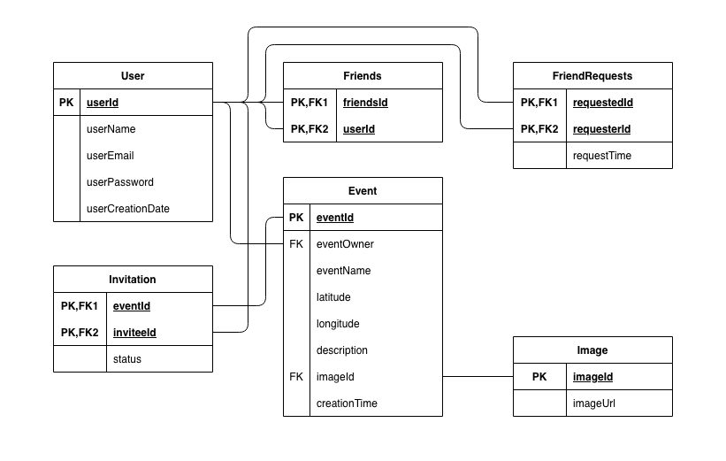

# Huddle

This is the backend for an imaginary application similar to 'Beer With Me' where you can inform your friends of an event that is currently happening by sending them your location coordinates and a short description. These events can range from meeting up in the park to finding people to learn together in the library.

Warning: Not ready for production!

## Used Technologies

* Docker
* Spring Boot 2.4.4 (with Maven, Java 11)
* Postgres 12

## Get started

**1. Start up Docker**

To start the Docker-container run following command:

```docker-compose up```

If the database was renamed run following command:

```docker-compose down -v```

To stop Docker container run following command:

```docker-compose down```

**2. Start up the Spring Boot application (e.g. via IntelliJ)**

**3. Open** `localhost:8080` **in your browser**
## Concept

Main features:
* Request to be friends
* React to friend request
* Create events
* React to invitations

For further insights check out the data model.

### Data Model



Disclaimer: The `Friends`-table is really time inefficient, but I only wanted to use a RDBMS. For real world usage, a graph database would be way more efficient!

### User Interface Mockups